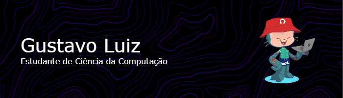

<h1>Olá! Eu sou o Gustavo Luiz Dessunte Bernardes!</h1>

- Atualmente estou Cursando Ciência da Computação com ênfase em Dados, na faculdade SpTech!
- Tenho conhecimento em:
  - Linguagens de programação: Xamarin, C# (CSharp), XAML, TypeScript, JavaScript e PHP,   
  - Linguagens de marcação: HTML e CSS,
  - Frameworks: Angular, Bootstrap e Kodular;
 
- Você pode me achar nas Plataformas: 

<!--
**gustavodessunte/gustavodessunte** is a ✨ _special_ ✨ repository because its `README.md` (this file) appears on your GitHub profile.

Here are some ideas to get you started:

- 🔭 I’m currently working on ...
- 🌱 I’m currently learning ...
- 👯 I’m looking to collaborate on ...
- 🤔 I’m looking for help with ...
- 💬 Ask me about ...
- 📫 How to reach me: ...
- 😄 Pronouns: ...
- ⚡ Fun fact: ...
-->
